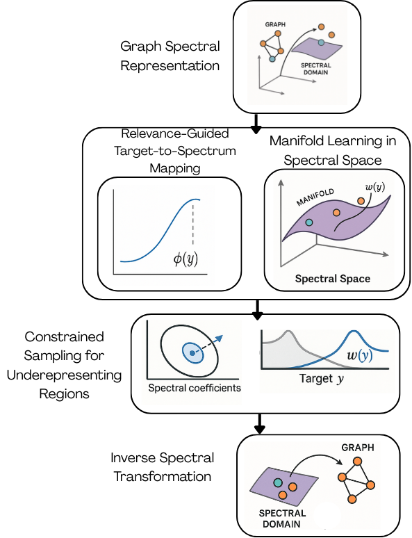

# Spectral Manifold Harmonization for Graph Imbalanced Regression
This is the code for [Spectral Manifold Harmonization for Graph Imbalanced Regression](https://arxiv.org/abs/2507.01132)

Graph-structured data is ubiquitous in scientific domains, where models often face imbalanced learning settings. In imbalanced regression, domain preferences focus on specific target value ranges that represent the most scientifically valuable cases; however, we observe a significant lack of research regarding this challenge. In this paper, we present Spectral Manifold Harmonization (SMH), a novel approach to address imbalanced regression challenges on graph-structured data by generating synthetic graph samples that preserve topological properties while focusing on the most relevant target distribution regions. Conventional methods fail in this context because they either ignore graph topology in case generation or do not target specific domain ranges, resulting in models biased toward average target values. Experimental resultsdemonstrate the potential of SMH on chemistry and drug discovery benchmark datasets, showing consistent improvements in predictive performance for target domain ranges. 



##  Requirements

Create the environment with:
```bash
conda env create -f environment.yml
conda activate smh
```
## 🚀 Usage

### Run Cross Validation
This will run standard cross-validation.

```
python main_cv.py
```

### Augment Data with SMH

To create augmentations and train a model using synthetic graphs:

```
from utils import *
from smh import SimpleSMH
import pandas as pd

# Prepare node indicators
node_indicator = get_node_indicator(dataset.smiles.values)

# Convert SMILES to networkx graphs
graphs_train = smiles_to_nx(dataset_train.smiles.values, node_indicator)

# Create relevance function
ph_ = phi_control(pd.Series(targets_train, dtype="float64"), extr_type="low")  # or "high", "both"

# Fit the SMH model
smh = SimpleSMH()
smh_model, best_params = smh.fit(graphs_train, targets_train, ph_)

# Generate synthetic graphs
synthetic_graphs, synthetic_targets, indices = smh.generate_samples(
    targets_train, n_samples=int(n_augmentations)
)

# Combine original and synthetic data
dataset_synthetic = creat_dataset_from_synthetic(synthetic_graphs, synthetic_targets, node_indicator)
dataset_augmented = dataset_train + dataset_synthetic

```
###  Train Model on Augmented Dataset
```
from train import train_model_new

augmented_model, train_losses, val_losses = train_model_new(
    dataset_augmented, dataset_valid,
    epochs=epochs,
    lr=lr,
    batch_size=batch_size,
    hidden_dim=hidden_dim,
    num_layers=num_layers
)

```
## 🧪Datasets

- [x] QM9
- [x] ESOL
- [x] FreeSolv

## 📌 Citation
```
@article{nogueira2025spectral,
  title={Spectral Manifold Harmonization for Graph Imbalanced Regression},
  author={Nogueira, Brenda and Gomes, Gabe and Jiang, Meng and Chawla, Nitesh V and Moniz, Nuno},
  journal={arXiv preprint arXiv:2507.01132},
  year={2025}
}
```

## 📬 Contact
For questions, open an issue or reach out at bcruznog@nd.edu
